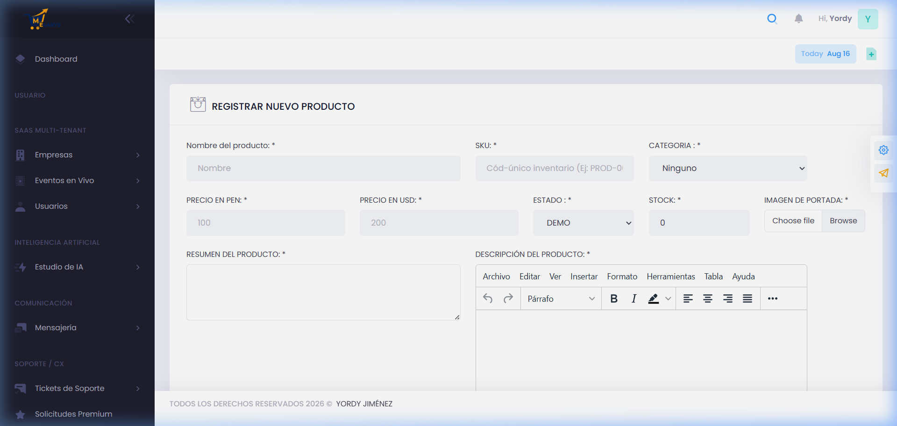
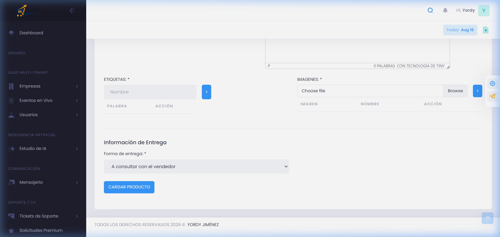
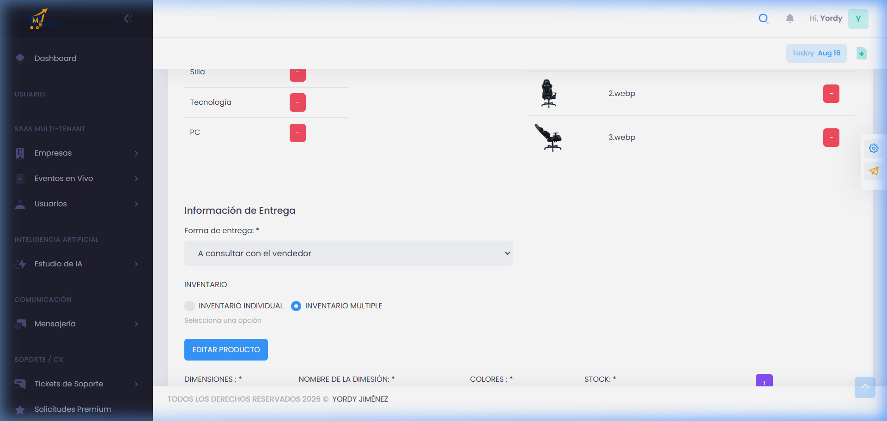
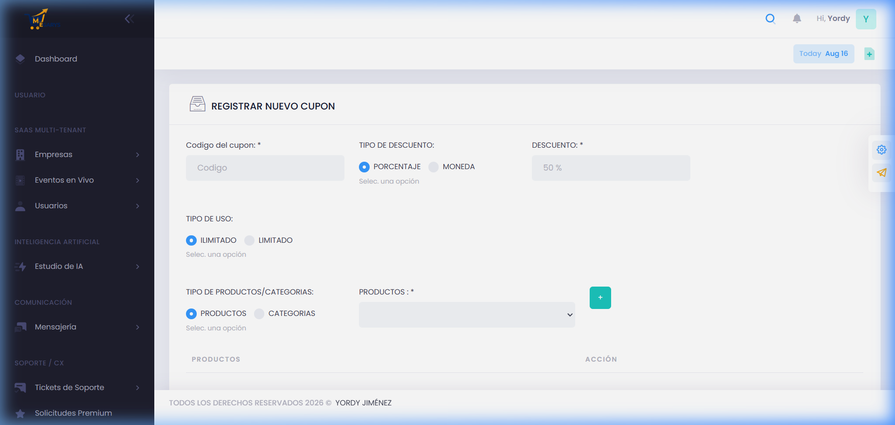
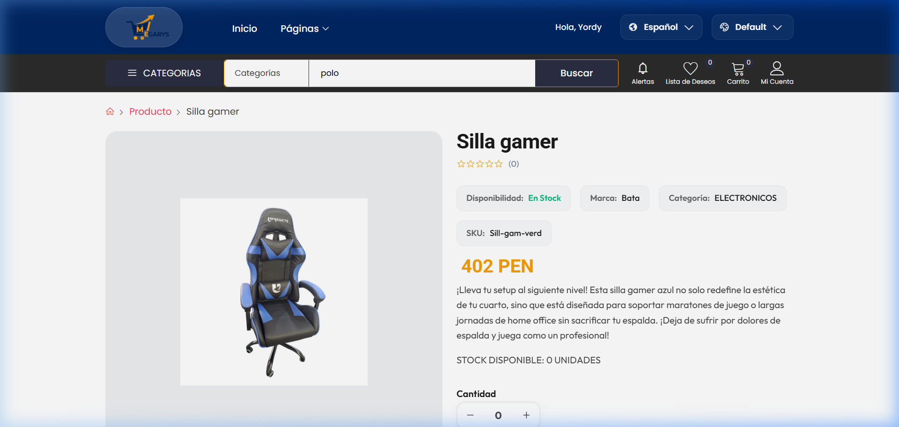
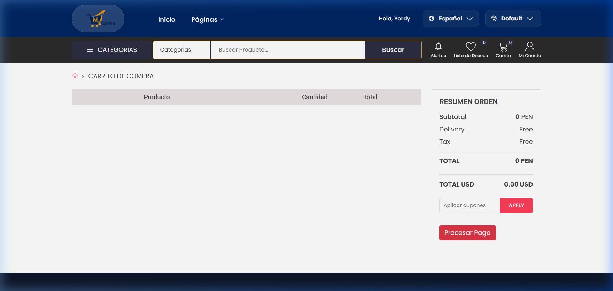

# 🎓 Guía Maestra: Sistema de Ecommerce

Esta guía detalla los procesos clave del sistema, desde la administración hasta la experiencia del cliente.

---

## 🛠️ Rol 1: Administrador

### 1. Registro de Nuevos Productos
Complete el formulario en la sección de "Productos".
*   **Campos**: Nombre, SKU, Categoría y Precios (PEN/USD).

---

### 2. Galería y Etiquetas
Gestione imágenes y etiquetas para SEO al final del formulario.

---

## 📦 Gestión de Inventario

### 3. Variaciones y Stock
El sistema permite stock individual o múltiple por características (talla/color).

---

### 4. Cupones de Descuento
Cree códigos promocionales con descuentos en porcentaje (%) o monto fijo.

---

## 🛒 Rol 2: Cliente

### 1. Tienda y Catálogo
Navegación intuitiva por categorías.

---

### 2. Detalle de Producto
Vista con selección de variaciones y precios.

---

### 3. Carrito de Compras
Resumen final y aplicación de cupones.

